# 1. 目录

[toc]

# 2. 项目设计

本项目旨在开发一个体测成绩查询系统，分为用户和管理员，用户可以查询成绩，管理员可以录入成绩

## 2.1 项目构成

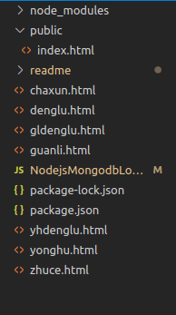

index.html是主页，该页面可以选择登录或者注册，可以向denglu.html或者zhuce.html跳转；

zhuce.html是注册页面，注册完成后跳转到用户登录yhdenglu.html页面；

denglu.html是登录选择页面，该页面可以选择管理员登录或者用户登录，可以向gldenglu.html或者yhdenglu.html跳转；

gldenglu.html是管理员登录页面，登录成功后跳转到guanli.html；

yhdenglu.html是用户登录页面，登录成功后跳转到yonghu.html；

guanli.html是管理员页面，可以进行数据录入；

yonghu.html是用户页面，可以查询数据，查询成功后跳转到chaxun.html；

chaxun.html是查询结果页面

## 2.2 引入的包

### 2.2.1 express

Express 是一个简洁而灵活的 node.js Web应用框架, 提供了一系列强大特性和丰富的 HTTP 工具帮助创建各种 Web 应用，使用 Express 可以快速地搭建一个完整功能的网站

Express 框架核心特性：

可以设置中间件来响应 HTTP 请求

定义了路由表用于执行不同的 HTTP 请求动作

可以通过向模板传递参数来动态渲染 HTML 页面

Express 应用使用回调函数的参数： request 和 response 对象来处理请求和响应的数据

request 对象表示 HTTP 请求，包含了请求查询字符串，参数，内容，HTTP 头部等属性

response 对象表示 HTTP 响应，即在接收到请求时向客户端发送的 HTTP 响应数据

### 2.2.2 ejs

ejs是一个express模版解析引擎，用于解析html模版生成对应的html的解析器

ejs的特性：    

缓存功能，能够缓存已经解析好的html模版

<% code %>用于执行其中javascript代码

%= code %>会对code进行html转义

<%- code %>将不会进行转义

支持自定义标签，比如'<%'可以使用'{{'，'%>'用'}}'代替

提供一些辅助函数，用于模版中使用

利用<%- include filename %>加载其他页面模版

### 2.2.3 mongoose

mongoose是在node.js异步环境下对mongodb进行便捷操作的对象模型工具

mongoose有自己的基本数据类型定义

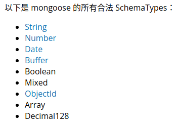

# 3. 使用说明

## 3.1 注册


点击“注册”按钮后进入注册页面

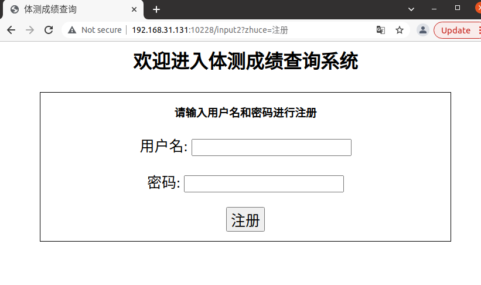

输入用户名和密码后点击“注册”，跳转到登录页面

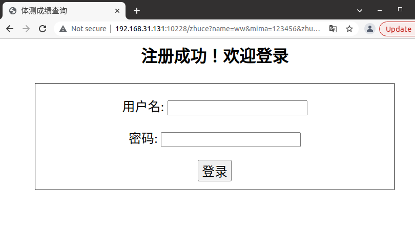

若用户名或密码输入为空，出现错误提示

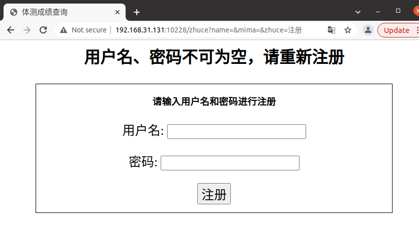

## 3.2 管理员

### 3.2.1 管理员登录

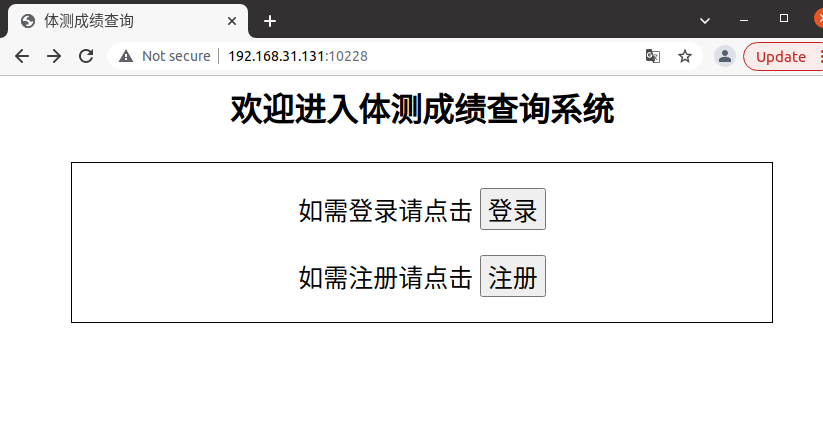

点击“登录“

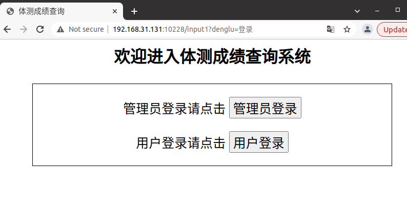

点击“管理员登录”

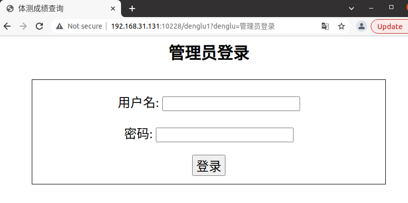

输入用户名和密码进行登录，管理员默认用户名为：wxy，密码为：123456

### 3.2.2 录入成绩

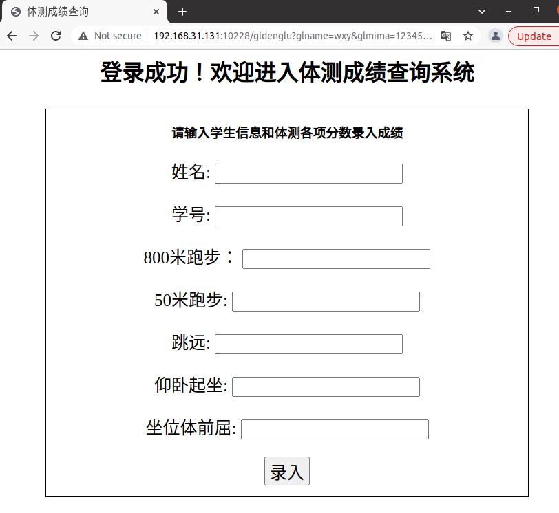

输入相应数据进行录入

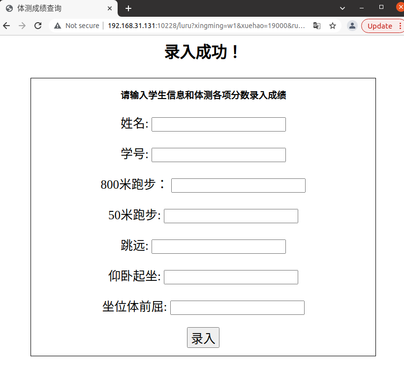

若姓名或学号为空，出现错误提示

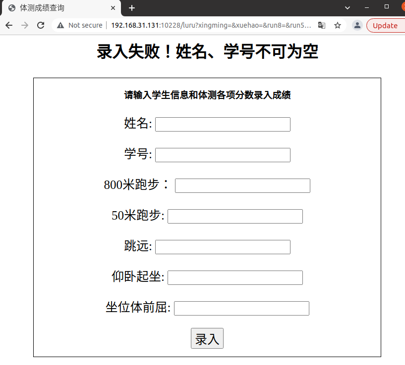

## 3.3 用户

### 3.3.1 登录


点击“用户登录”，目前已注册的可用于登录的账号有：用户名：wq，密码：12345678

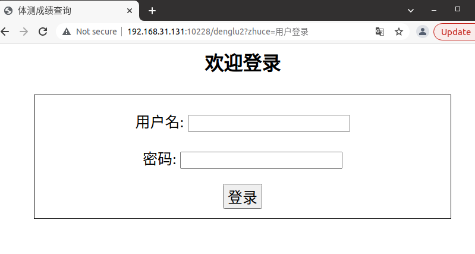

若用户名或密码输入错误，出现错误提示

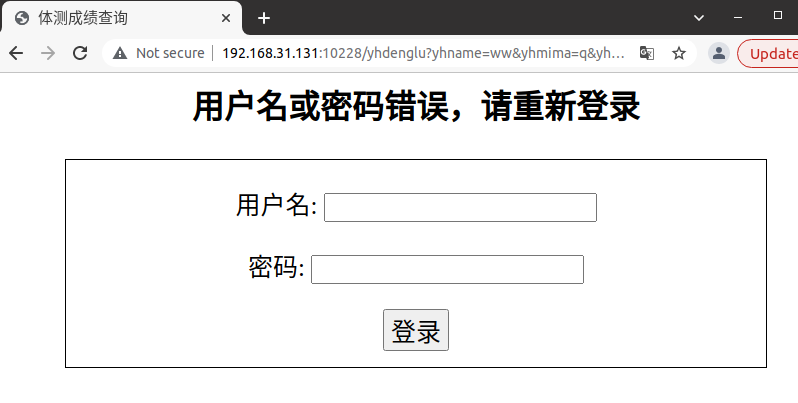

### 3.3.2 查询成绩

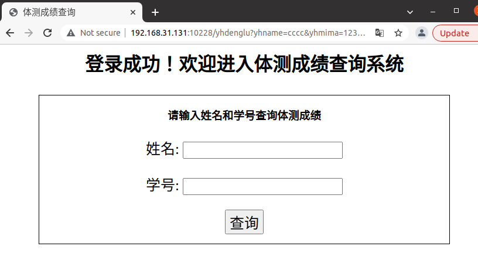

输入姓名、学号查询相关信息

目前数据库中存入的可查询的数据有

```
姓名：张三    学号：1900001
姓名：李四    学号：1900002
姓名：刘三    学号：1900003
姓名：黄四    学号：1900004
姓名：白五    学号：1900005
姓名：赵四    学号：1900006
```

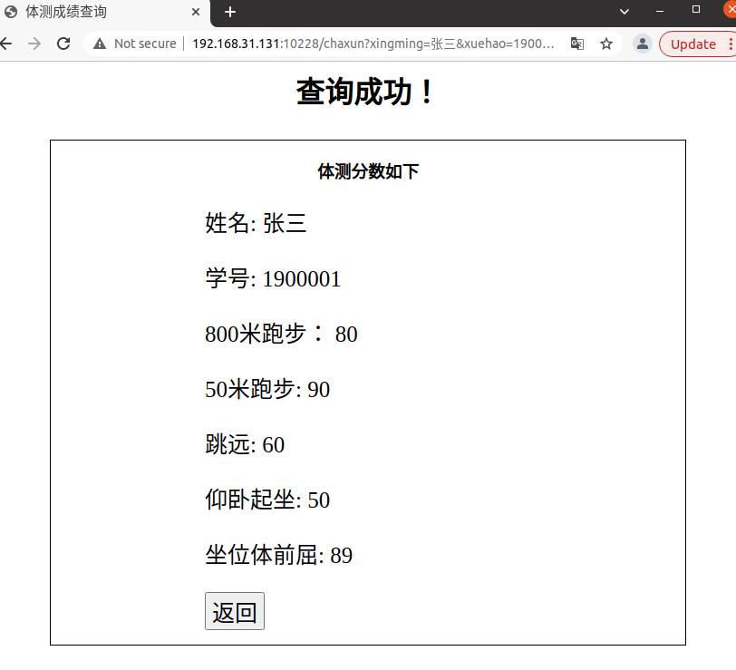

点击“返回”可以回到查询页面

若学号或姓名输入为空，出现错误提示

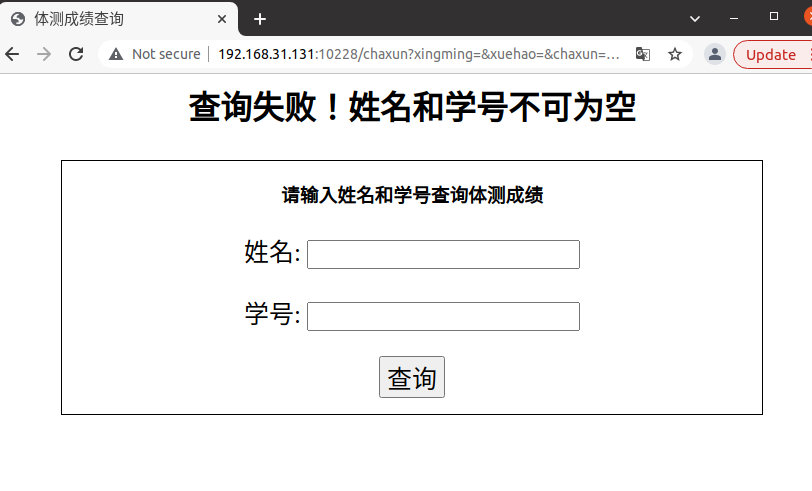

若未查询到输入姓名、学号的相应信息，出现“未查询到相关信息”提示

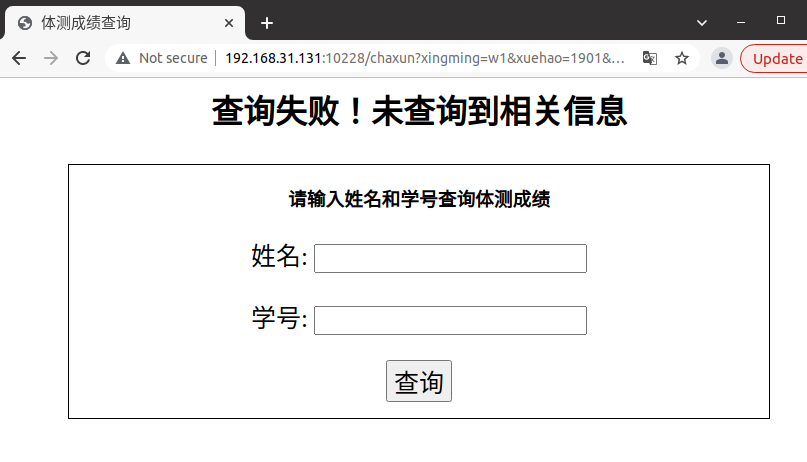

# 4. 开发日记

## 4.1 commit01

2021年12月25日

圣诞节快乐！

这次commit初步实现了主页、登录、注册的页面，实现了主页到登录页面的跳转和到注册页面的跳转


页面很简陋，期末事情很多来不及慢慢做了

今天没有去学校，就连接了本地数据库来做，但是一直连接失败，百度了很多办法都没有用

最后试了把data里的文件全部删掉，就可以连接了，好像是之前连接没有正常退出导致了这次连接失败

## 4.2 commit02

2021年12月26日

这次commit把登录、注册功能完善了一下


发现一个尴尬的问题，之前居然把体测的测全都打成了“侧”

幸好发现得不算晚

## 4.3 commit03

2021年12月26日 

这次commit实现了用户登录后的查询功能、管理员登录后的录入成绩功能

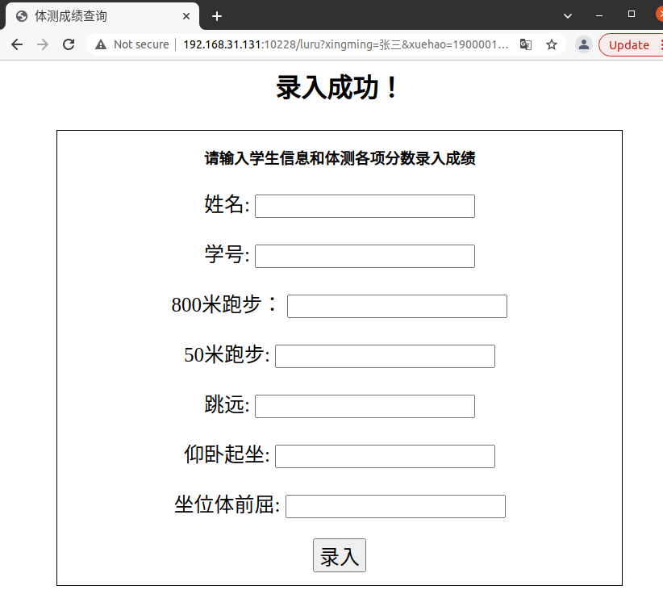

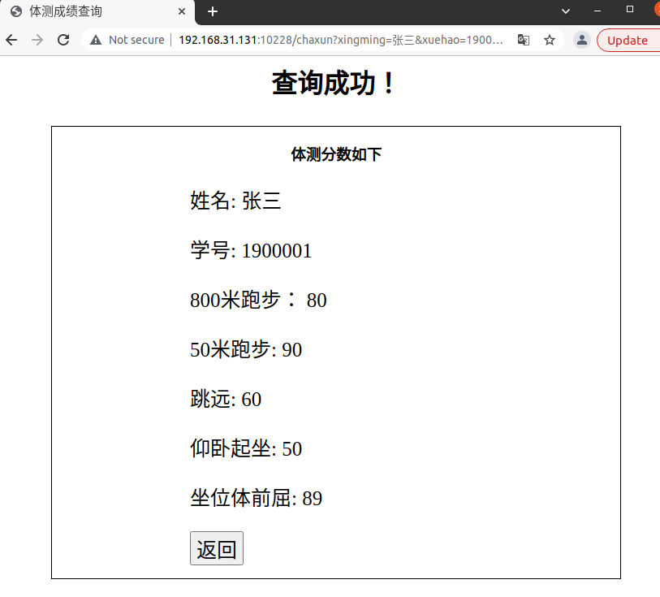

## 4.4 commit04

2021年12月28日

这次commit完善了一些存在的问题，连接了远程数据库，录入了数据
