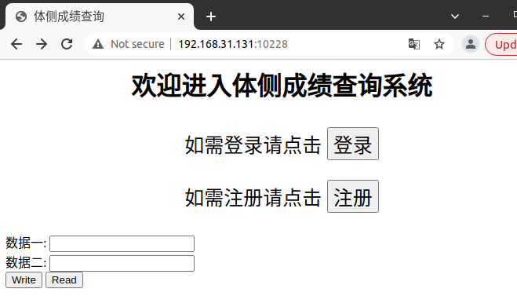
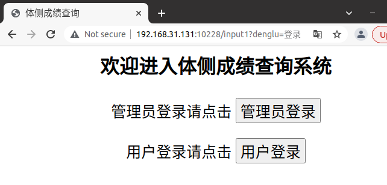
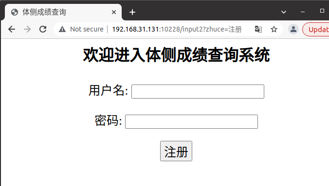
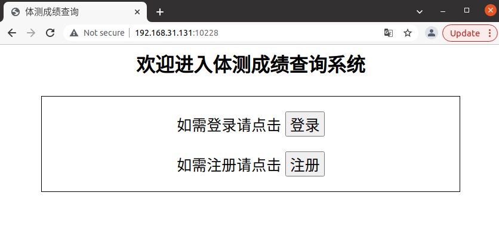
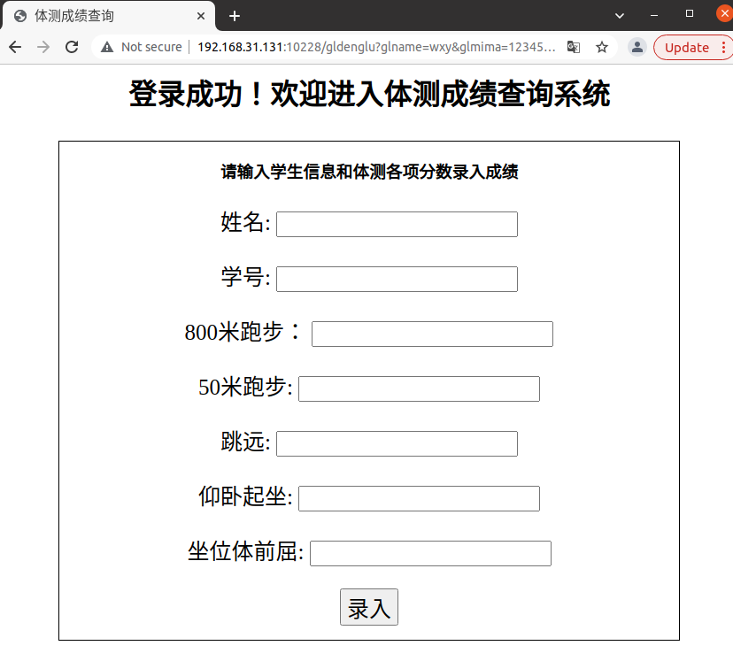
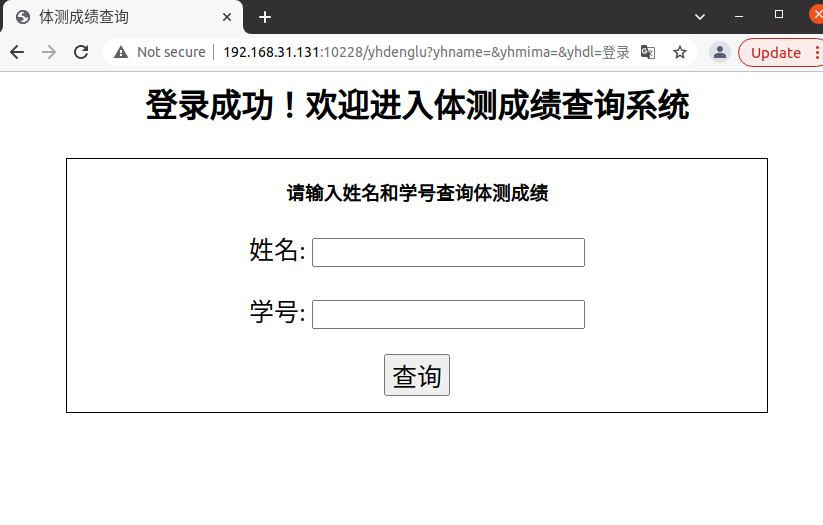
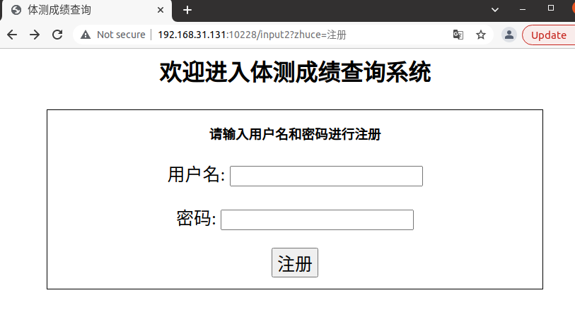

### commit01

2021年12月25日

圣诞节快乐！

这次commit初步实现了主页、登录、注册的页面，实现了主页到登录页面的跳转和到注册页面的跳转

页面很简陋，期末事情很多来不及慢慢做了

今天没有去学校，就连接了本地数据库来做，但是一直连接失败，百度了很多办法都没有用

最后试了把data里的文件全部删掉，就可以连接了，好像是之前连接没有正常退出导致了这次连接失败

### commit02

2021年12月26日

这次commit把登录、注册功能完善了一下

发现一个尴尬的问题，之前居然把体测的测全都打成了“侧”

幸好发现得不算晚

